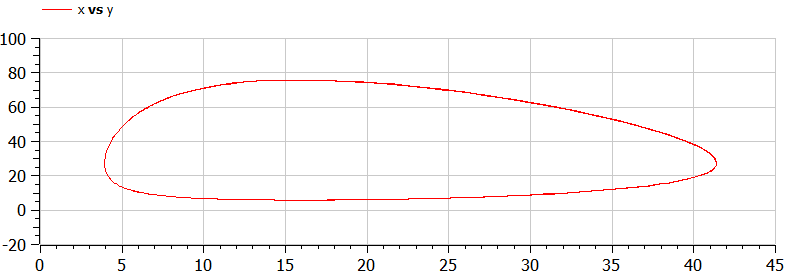
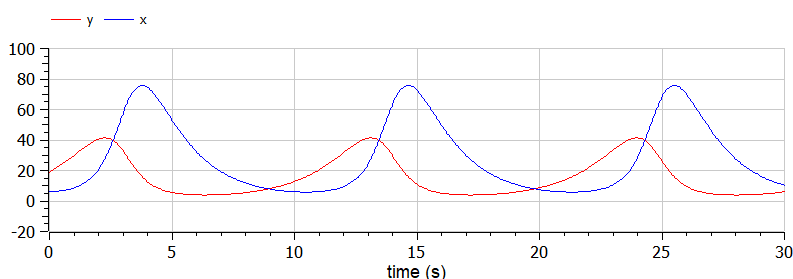

# Цель работы

Рассмотреть простейшую модель взаимодействия двух видов типа «хищник — жертва» — модель **Лотки-Вольтерры**. Построить модель и визуализировать фазовые портреты.

# Задание
Вариант 47

В лесу проживают $х$ число волков, питающихся зайцами, число которых в этом же лесу $у$. Пока число зайцев достаточно велико, для прокормки всех волков, численность волков растет до тех пор, пока не наступит момент, что корма перестанет хватать на всех. Тогда волки начнут умирать, и их численность будет уменьшаться. В этом случае в какой-то момент времени численность зайцев снова начнет увеличиваться, что повлечет за собой новый рост популяции волков. Такой цикл будет повторяться, пока обе популяции будут существовать. Помимо этого, на численность стаи влияют болезни и старение. 

Для модели «хищник — жертва»:

$$\begin{cases} \frac{dx}{dt} = -0.7x(t) + 0.044x(t)y(t) \\ \frac{dy}{dt} = 0.6y(t) - 0.022x(t)y(t) \end{cases}$$

Постройте график зависимости численности хищников от численности жертв, а также графики изменения численности хищников и численности жертв при следующих начальных условиях: $x_0 = 6$, $y_0 = 19$. Найдите стационарное состояние системы.

# Теоретическое введение

Данная двувидовая модель основывается на следующих предположениях: 

1. Численность популяции жертв x и хищников y зависят только от времени (модель не учитывает пространственное распределение популяции на занимаемой территории).
2. В отсутствии взаимодействия численность видов изменяется по модели Мальтуса, при этом число жертв увеличивается, а число хищников падает.
3. Естественная смертность жертвы и естественная рождаемость хищника считаются несущественными.
4. Эффект насыщения численности обеих популяций не учитывается. 
5. Скорость роста численности жертв уменьшается пропорционально численности хищников.

$$\begin{cases}\frac{dx}{dt} = ax(t) - bx(t)y(t) \\ \frac{dy}{dt} = -cy(t) + dx(t)y(t)\end{cases}\;\;\;\;(1)$$       

В этой модели:

- $x$ — число жертв. 
- $y$ — число хищников. 
- $a$ — коэффициент, который описывает скорость естественного прироста числа жертв в отсутствие хищников.
- $с$ — коэффициент, который описывает естественное вымирание хищников, лишенных пищи в виде жертв.  
- $b$ — коэффициент, который уменьшает популяцию жертв при каждом акте взаимодействия.
- $d$ — коэффициент, который увеличивает популяцию хищников при каждом акте взаимодействия.

Математический анализ этой (жесткой) модели показывает, что имеется стационарное состояние $A$, всякое же другое начальное состояние $B$ приводит к периодическому колебанию численности как жертв, так и хищников, так что по прошествии некоторого времени система возвращается в состояние $B$.

# Выполнение лабораторной работы

1. Код программы с комментариями:

   ```
   model lab5
     constant Real a = 0.7; 
     constant Real b = 0.044; 
     constant Real c = 0.6; 
     constant Real d = 0.022; 
     Real x; // число хищников
     Real y; // число жертв
   initial equation
     x = 6;
     y = 19; 
   equation
     der(x)=-a*x+b*x*y;
     der(y)=c*y-d*x*y;
   end lab5;
   ```

2. График изменения численности хищников от изменения численности жертв (рис. [-@fig:003]):
   
   
   


3. График изменения численности хищников и численности жертв от времени (рис. [-@fig:004]):

   


# Выводы

Благодаря данной лабораторной работе познакомился с простейшей моделью взаимодействия двух видов типа "хищник-жертва" - моделью **Лотки-Вольтерры**, а именно научился:

- строить модель "хищник-жертва".
- строить фазовые портреты системы "хищник-жертва".
- находить стационарное состояние системы "хищник-жертва".


# Список литературы

- <code>[Кулябов Д.С. *Лабораторная работа №5*](https://esystem.rudn.ru/mod/resource/view.php?id=831045)</code>
- <code>[Кулябов Д.С. *Задания к лабораторной работе №5 ( по вариантам )*](https://esystem.rudn.ru/mod/resource/view.php?id=831046)</code>